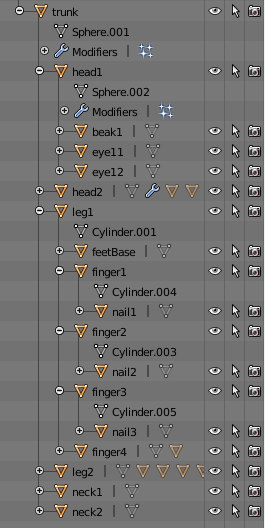
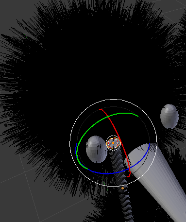
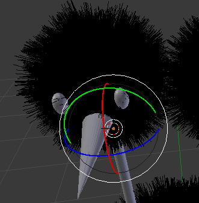
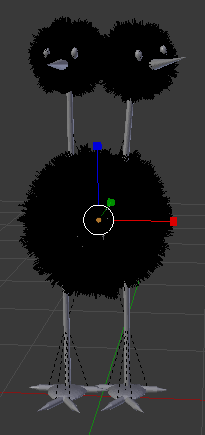
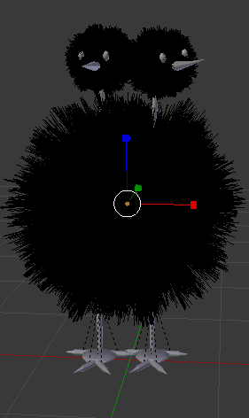
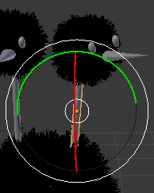
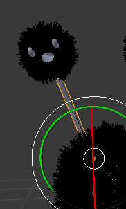
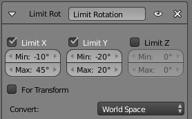
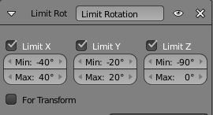

#Práctica 2: Creación de modelos
## Gustavo Rivas Gervilla

### Introducción
En un primer momento pensé en añadir un esqueleto (*armature*) a mi proyecto actual de modo que la animación, los movimientos de Doduo, pudiese modelarlos a través de este esqueleto. Esto es algo que se emplea mucho en animación y vi algunos tutoriales que se enlazan en la documentación consultada en los que se mostraban ejemplos sencillos de animación empleando esta técnica. El problema es que los huesos no permiten imponer restricciones a las transformaciones que se les aplican con lo que no podríamos poner en práctica todo lo aprendido. Con lo cual vamos a trabajar directamente con los objetos que creamos en la práctica anterior para modelar a Doduo.

Nos centraremos en dar movimiento a las cabezas y los cuellos del pokemon, aunque ya establecimos un modelo jeráquico en la práctica anterior, antes vamos a establecer algunas relaciones de parentesco más y luego ya pasaremos a imponer las restricciones pertinentes sobre el movimiento de estas partes.

### Mejorando el modelo jerárquico

Primero lo que hacemos es establecer una relación de parentesco entre todas las partes que componen a Doduo y el tronco, queremos que las transformaciones que le apliquemos a esta parte central del modelo se le apliquen al modelo al completo, como sería natural. Lo que hacemos para ello es seleccionar todos los objetos del modelo presionando `A`, una vez hayamos deseleccionado los objetos que no serán hijos (la cámara y la lámpara) y el propio tronco (siempre manteniendo pulsada la tecla `SHIFT`), volvemos a seleccionar el tronco, pulsamos `CTRL + P` y elegimos la opción `Object`; así tendremos la siguiente composición:

### Cambiando los centros de las cabezas y cuellos

Ahora lo que vamos a hacer establecer una relación de parentesco entre cada cabeza y el cuello correspondiente, de este modo la cabeza se moverá en consonancia con su cuello como cabría esperar. Para hacer esto simplemente realizamos el mismo proceso que acabamos de describir pero sólo involucrando una cabeza y un cuello cada vez.

En primer lugar lo que vamos a hacer es fijar el centro de cada cabeza a la base del cuello; de este modo haremos que el movimiento sea más natural ya que una cabeza rota en base a su cuello y no libremente.

Para ello lo que hacemos es seleccionar uno de los cuellos e ir al *modo edición*, entonces seleccionamos la cara superior del cilindro y elegimos el comando `Mesh > Snap > Cursor to Selected`.

Ahora volvemos al *modo objeto* y seleccionamos la cabeza correspondiente y seleccionamos el comando `Object > Transform > Origin to 3D Cursor` y así tendremos ya listo el eje de giro que deseamos para una cabeza. Con la segunda realizamos el mismo procedimiento.

Cuando hemos pasado a imponer restricciones en las transformaciones que se pueden aplicar en cada uno de los cuellos nos hemos dado cuenta de que el giro no quedaba demasiado bien, entonces lo que se ha hecho ha sido moves, siguiendo el mismo proceso descrito para las cabezas, los centros de los cuellos a una cara del tronco.

### Fijando transformaciones

Ahora lo que vamos a hacer es fijar las transformaciones que le hemos venido haciendo a las cabezas, los cuellos y el tronco. De este modo impondremos las restrcciones sobre el pose actual sin tener acumuladas todas las tranformaciones que nos han llevado a él.

Algo que observamos es que cuando hacemos esto sobre el cuerpo o las cabezas entonces las particulas que añadimos para los pelos parecen que se agrandan, en cambio si pasamos al modo edición y luego volvemos entonces ya se escalan correctamente y se fijan correctamente las transformaciones.

Para ir fijando estas transformaciones simplemente lo que haremos es seleccionar uno a uno los objetos, pulsar `CTRL + A` y seleccionar `Rotation & Scale`. He optado por no fijar también la localización ya que parecía mover el centro del objeto al (0,0,0) y por tanto los giros se hacen teniendo este punto como referencia, con lo cual no obtendríamos el efecto deseado al rotar las distintas partes del objeto. Ahora ya podemos pasar a imponer restricciones sobre los moviemientos de cada una de las partes.

### Imponiendo restricciones

* Lo primero que vamos a hacer es que los cuellos no puedan girar en el **eje Z**, para ello simplemente seleccionamos cada cuello y pulsamos en el candado que fija ese parámetro para que no se pueda cambiar.

Ahora vamos a restringir el ángulo de giro de los cuellos en los **ejes X e Y**, para ello lo que hemos hecho ha sido ir rotando el cuello introduciendo el ángulo en la ventana de transformación hasta ver qué extremos estábamos dispuesto a admitir, y luego hemos añadido la restricción correspondiente teniendo en cuenta estos intervalos que hemos validado empíricamente. Aquí podemos ver cómo la máxima rotación hacia la izquierda que le permitimos al cuello izquierdo y la restricción que hemos añadido a este cuello:

Ahora para la primera cabeza seguimos un procedimiento similar al anterior. En cambio para la segunda, dado que partimos de que ya tiene una cierta rotación hacia la derecha en el eje Z lo que haremos es colocar la primera cabeza en sus dos posiciones extremas en este eje y en base a ello restringir el rango de valores de la rotación en el **eje Z** de la cabeza de la derecha. Para los otros dos ejes a ambas cabezas le imponemos la misma restricción. Aquí vemos la restricción impuesta a la cabeza derecha:

### Enlaces consultados
* [Tutorial *bones* en Blender 1](https://www.youtube.com/watch?v=EcNGeIV0BsU)
* [Tutorial *bones* en Blender 2](https://www.youtube.com/watch?v=GzboWLUPADY)
* [Aplicar transformaciones a objetos](https://wiki.blender.org/index.php/User:Fade/Doc:2.6/Manual/3D_interaction/Transform_Control/Reset_Object_Transformations)

