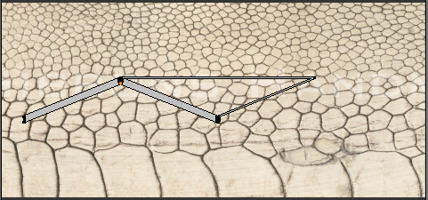
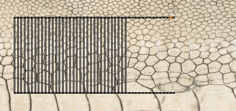

# Práctica 3: Texturas
## Gustavo Rivas Gervilla

### Aplicando una textura a una esfera

Algo que hemos tenido que hacer al generar las coordenadas de textura es, en el menú que aparece al crear las coordenadas con proyección cilíndrica, seleccionar la opción `Direction -> Align to Object` de este modo aparece un rectángulo en las coordenadas del centro de la malla de coordenadas que se genera, de otro modo se ven dos tiras a los lados que no son completas, de hecho son una complementaria de la otra como mostramos en la siguiente figura:

Luego no hemos tenido más que escalar y mover esta malla. Además hay un vértice que comparte cara con diversos 

TODO todo lo anterior se va a eliminar pues dijo el profesor que no hacía falta documentar este proceso.

Pelillos problema

TODO agregar enlace a lo que se debería hacer en teoría para que el sistema de partículas tome la textura asignada al *mesh* del que depende. [tutorial](http://blender.stackexchange.com/questions/38207/particle-color-based-on-where-the-particle-is-emitted)

Para dar el material a la cabeza y al cuerpo lo que hemos hecho es abrir una imagen de Doduo con GIMP para saber el color exacto a darle al materia RGB(222,150,116), para ello simplemente hemos usado la herramienta de selector de color de este software.

Es importante señalar que no necesitamos crear un material para cada uno de los objetos de la escena, en lugar de hacer esto no tenemos más que desplegar en la pestaña de materiales el listado de materiales ya creados y elegir uno previamente fijado. De este modo la edición de un material será mucho más eficiente.

Es importante la posición en el que tengamos la cámara a la hora de generar las coordenadas de textura ya que dependiendo de la posición las coordenadas de textura se generarán de un modo u otro. Veamos un ejemplo de esto:

Y ahora si elegimos `View -> View Persp/Ortho` y nos ponemos con la vista frontal sí que obtenemos unas coordenadas de textura similares a lo que cabría esperar:

Lo que he hecho para dar textura a la pata es tomar la imagen que me he descargado y ajustar de modo que las caras tomen sólo la parte con más granularidad, de este modo consigo que el final de la pata no se vea con un color plano
