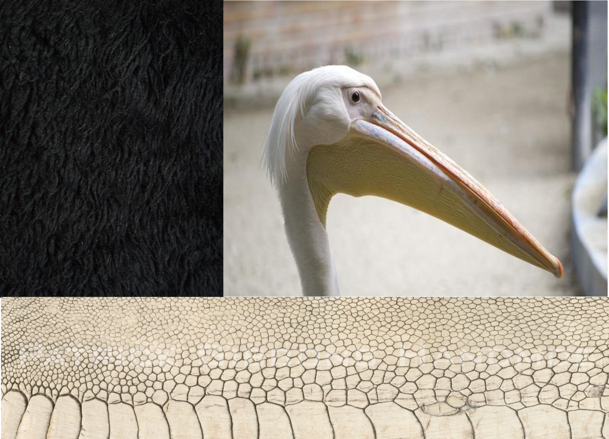
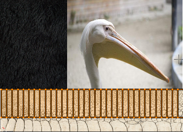
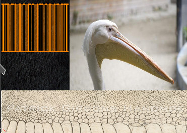
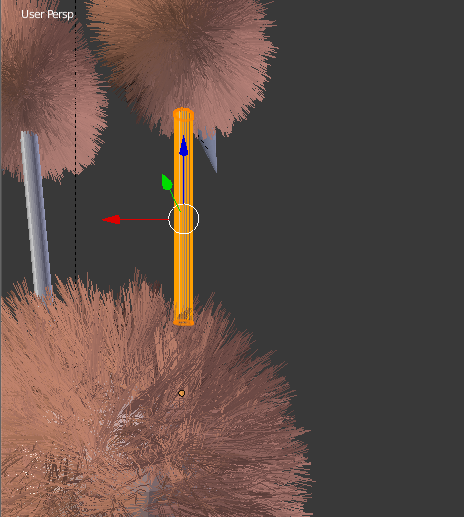
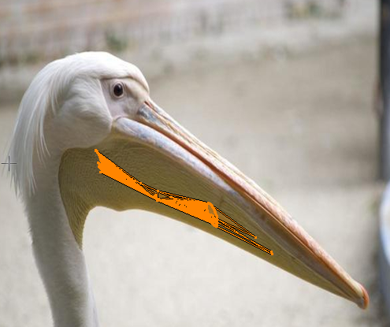
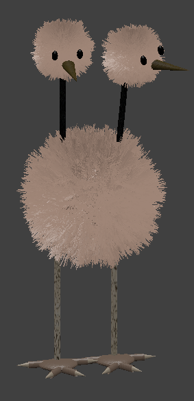

# Práctica 3: Texturas
## Gustavo Rivas Gervilla

### Materiales

En un principio la idea era asignarle textura a las partículas que simulan los pelos de Doduo. El problema es que asignarle una textura a la esfera no hace que se aplique directamente al sistema de partículas asociado a ella. Para hacer esto tendríamos que hacer algo como lo que leímos en un [hilo](http://blender.stackexchange.com/questions/38207/particle-color-based-on-where-the-particle-is-emitted) del stackexchange de Blender. Por lo cual en este caso optamos por aplicar materiales básicos para estas partes de nuestro proyecto.

Para dar el material a la cabeza y al cuerpo lo que hemos hecho es abrir una imagen de Doduo con GIMP para saber el color exacto a darle al materia RGB(222,150,116), para ello simplemente hemos usado la herramienta de selector de color de este software. Entonces una vez que tenemos el color concreto que queremos aplicar no tenemos más que agregar un material al cuerpo y cambiar el color del mismo. A este material lo he llamado *hairMaterial*.

Es importante señalar que no necesitamos crear un material para cada uno de los objetos de la escena, en lugar de hacer esto no tenemos más que desplegar en la pestaña de materiales el listado de materiales ya creados y elegir uno previamente fijado. De este modo la edición de un material será mucho más eficiente. Así hemos asignado el material a las dos cabezas del doduo. Por otro lado a los ojos le hemos asignado simplemente un material negro simple.

Al final del proceso también hemos asignado un material sólido a la base de los dedos y para los dedos en sí, tratando que vaya en consonancia a la textura aplicada a la pata.

### Texturas

En primer lugar lo que hemos hecho es combinar todas las imágenes de textura en una sola de modo que por un lado nuestro modelo tenga sólo una imagen de textura asociada y por otro la asignación de las coordenadas de textura tenga cierta complejidad:

#### Patas

Es importante la posición en el que tengamos la cámara a la hora de generar las coordenadas de textura ya que dependiendo de la posición las coordenadas de textura se generarán de un modo u otro. Veamos un ejemplo de esto:

Y ahora si elegimos `View -> View Persp/Ortho` y nos ponemos con la vista frontal sí que obtenemos unas coordenadas de textura similares a lo que cabría esperar:

A continuación muestro la asignación de coordenadas de textura final con la imagen que hemos generado con las 3 texturas que vamos a usar:

#### Cuellos

En esta ocasión hemos tenido un problema al generar las coordenadas de textura, aunque eligiésemos como antes la proyección ortogonal y la vista frontal las coordenadas se generaban de una forma extraña como ocurría en la de las patas. Probablemente esto se deba a que tenemos el centro del cilindro fuera del mismo. Tras varios intentos para situar la cámara correctamente lo mejor que hemos obtenido es lo siguiente:

Para ello hemos colocado la cámara del siguiente modo:

Un proceso similar hemos seguido para el dar cordenadas de textura al otro cuello.

#### Picos

Este proceso ha sido algo más complejo ya que realmente el pico está formado por dos conos deformados pero que no están separados si no que fusioné en un sólo objeto, con lo cual aunque he querido colocar la cámara de la forma más apropiada posible, y usando los comandos de escalado, desplazamiento y rotación (R-x y R-y) lo que hemos conseguido ha sido lo siguiente:

Y aquí tenemos el modelo final rederizado:

