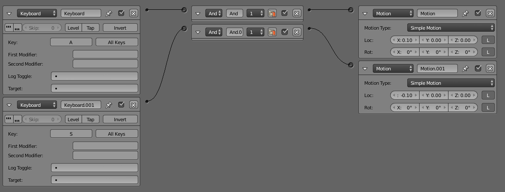
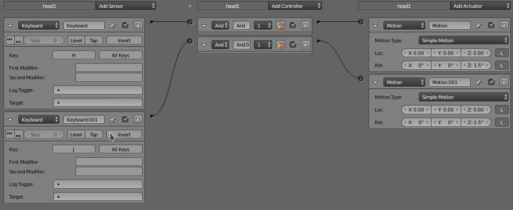
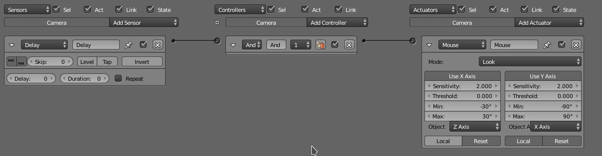

# Práctica 3: Texturas
## Gustavo Rivas Gervilla

### Primeros pasos

Antes de pasar a configurar la interacción con el objeto se han de realizar dos acciones para que el funcionamiento sea correcto:

* Eliminamos del tronco y las dos cabezas el sistema de partículas que simula el pelo de Dodudo; los sistemas de partículas son incompatibles con el modo de juego. Las soluciones encontradas para esto son demasiado complejas y escapan a los objetivos de esta práctica.

* Luego hemos hecho que, por recomendación del profesor, que las transformaciones(rotaciones y escalados) aplicadas a los objetos sean la identidad. Para hacer esto del modo más rápido posible seleccionamos todos los hijos del tronco (que es el padre de todos) con `SHIFT - G`, luego volvemos a seleccionar el tronco y ya elegimos la opción (estando en modo objeto) `Object -> Apply -> Rotation & Scale`.

### Configurando el movimiento del avatar

* Se ha añadido un cubo simple en un punto de la escena para que nos sirva como referencia del movimiento de Doduo. Esto lo hacemos ya que cuando hagamos que la cámara siga al objeto en su movimiento no apreciaremos movimiento ninguno y por tanto no podremos comprobar el correcto funcionamiento de la interacción.

* El desplazamiento que hacemos de Doduo es el eje X, de izquierda a derecha, para ello lo que hemos hecho es añadir dos eventos de teclado, uno para movernos hacia la derecha y otro para movernos en la izquierda. Para la práctica siguiente, y ya que tenemos manejo con la interacción haremos que esta interacción sea similiar a la de cualquier viedejuego en primera persona. A continuación mostramos la configuración de estos eventos en el editor de lógica:

* El otro tipo de interacción que hemos añadido ha sido hacer girar las cabezas sobre el eje Z en ambos sentidos, para asociamos el mismo evento de teclado con actuadores de movimiento (en esta ocasión de tipo rotación) para cada una de las cabezas. Entonces lo que tenemos en la lógica de cada una de las cabezas del objeto es lo siguiente:

En resumen tenemos las siguiente interacciones:

| Tecla |               Acción              |
|:-----:|:---------------------------------:|
|   A   |       mover hacia la derecha      |
|   S   |      mover hacia la izquierda     |
|   H   | girar cabezas sentido antihorario |
|   J   |   girar cabezas sentido horario   |

### Configurando el movimiento de la cámara

* Para hacer que la cámara siga a Doduo mientras nos movemos nos basta con que esta sea hija del tronco de Doduo. Se ha tratado de conseguir este efecto con el evento `always` y el actuador de tipo `camera` pero con esto no conseguíamos el efecto deseado. Lo que ocurría era que cuando movíamos el avatar este se alejaba de la cámara, no lo seguía.

* Finalmente para poder mover la cámara con el ratón en el modo juego hemos seguido las instrucciones del guión de prácticas, sin embargo hemos tenido que desmarcar las opciones de level triggering como se muestra en la captura siguiente: 

