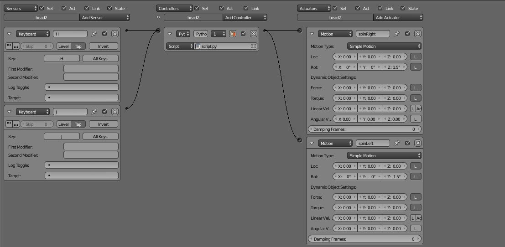

# Práctica 5: Simulación
## Gustavo Rivas Gervilla

### Las físicas añadidas

Lo primero que he hecho ha sido añadir un plano a modo de suelo de modo que nos sirva como límite para los objetos de la escena a los que le vamos a añadir propiedades físicas. Para ello simplemente he colocado el plano en el (0,0,0) y lo he escalado para tener espacio suficiente. Luego he aplicado, como vimos en la práctica anterior, la transformación al objeto de modo que no se produzcan posibles problemas al pasar al modo juego. Este objeto será static simplemente, no queremos que se mueve, sólo que haga de soporte para el resto de objetos.

#### El cuerpo

Para el cuerpo, entendiendo como el cuerpo el tronco (objeto *trunk*) y todos los elementos que cuelgan de él en la jerarquía, hemos establecido el tipo *Dynamic* y hemos elegido que se añadan los *collision bounds* calculados con el *convex hull* del objeto. Señalar que hemos elegido el tipo de objeto *Dynamic* y no *Rigid Body* porque de este modo evitamos que si el objeto pilla un objeto de tipo *Soft Body* vvuelque, ya que el motor de juego no cambia la orientación de tipo *Dynamic*.

Además inicialmente habíamos establecido el tipo de objeto como *Static* y no apreciábamos problema ninguno ya que sí que podíamos mover el objeto con el teclado, una cosa es el movimiento del objeto calculado por el motor y otra el que nosotros induzcamos a través de la interacción con el teclado. Lo que sí ocurría era que al colisionar dos objetos el cálculo de colisiones resultaba muy lento y por lo tanto la animación no resultaba fluida. El hecho de haber escodigo anteriormente el tipo *Static* se debía a que de otro modo el cuerpo salía despedido del escenario.

Esto se debía a que el objeto es un objeto compuesto con lo que las partes colisionan entre sí lo que provocaba este salto, para evitar este problema al usar el tipo *Dynamic* lo que hacemos es seleccionar una vez hemos añadido los *collision bounds* la opción *Compound* indicando que este objeto es compuesto y que por tanto se calculen las colisiones entre las partes.

#### Las esferas

En prime lugar señalar que se está trabajando con esferas simplemente porque la deformación sufrida por estos objetos se aprecia mejor que por ejemplo en un cubo, probablemente esto se deba tanto a la forma del objeto como al número de vértices que tienen, por defecto, cada uno de los objetos, permitiendo en el caso de las esferas realizar una simulación más precisa sin necesidad de editar el objeto para añadirme más caras y vértices. Se han empleado las esferas tanto para tener algunos objetos con los que el avatar pueda interactura como para probar distintos tipos de parámetro físicos. Así tenemos las siguientes esferas con las siguientes propiedades físicas:

* **Azul:** simplemente una esfera de tipo *Rigid Body*, no elegimos el tipo *Dynamic* porque queremos que la esfera pueda girar.
* **Blanca:** es una esfera de tipo *Soft Body*, si nos fijamos en la deformación que sufre al chocar contra el suelo es mayor que cuando simplemente elegimos que una esfera sea de tipo *Soft Body*, además de ser mucho mayor que la que sufre la esfera amarilla, esto se debe al valor que le hemos dado al parámetro *Threshold*, 0.01, en cambio para la esfera amarilla lo ponemos a 0.2, este parámetros establece la resistencia a la deformación que tiene el objeto, mayor cuanto mayor sea su valor. Además señalar que si no seleccionamos la opción *Shape Match* entonces la deformación que sufrirá el objeto será total, no intentará volver a su forma original.
* **Amarilla:** en esta esfera, además de lo que acabamos de comentar, hemos cambiado su masa para que sea de 1000 unidades. De este modo cuando chocamos contra ella es el avatar el que se desplaza más, si golpeamos con la suficiente velocidad y en un punto adecuado podemos salir despedidos.

### Las restricciones añadidas

En cuanto a las restricciones hemos añadido nuevos objetos para trabajar con ellas así tenemos:

* **La cadena de cubos:** cada cubo, que es de tipo *Rigid Body*, está conectado al siguiente con una restricción de tipo *Ball* la que podríamos considerar la más simple de todas. De este modo conseguimos el efecto de tener una especie de cuerda formada por cubos que se balancea al caer hacia abajo.
* **El cilindro junto con la esfera:** en esta ocasión he unido la esfera al cilindro con una restricción de tipo *Cone Twist* algo que puede apreciarse en cierta forma por el movimiento que tiene el péndulo que es el cilindro. Señalar aquí que no se ha establecido ningún límite en ninguno de los tres ejes de rotación ya que conseguíamos efectos muy raros, una especie de colisiones que hacía en ocasiones que el cilindro girase alrededor de toda la esfera a bastante velocidad como si de un molino se tratase; desconozco la causa de tal efecto.

### Añadiendo de nuevo las texturas

Al pasar al motor *Blender Render* se perdieron las texturas, no las veíamos, si elegíamos el modo *Texture* el tronco de Doduo aparecía rosa, buscando en Internet descubrimos que estoy podía deberse a un documento no encontrado. Tras algunas pruebas de intentar localizar los archivos mediantes la opción **File > External Data > Find Missing Files** podíamos ver la imagen con las coordenadas de textura asignadas pero seguían sin verse aplicadas en el modelo.

Finalmente lo que se hizo fue seleccionar en la ventana *UV/Image Editor* y elegir la opción que *desenlazaba el bloque de código* pulsando sobre la X que aparece y volver a cargar la imagen. Por suerte no ha sido necesario volver a calcular las coordenadas ya que la imagen desaparecía pero no la proyección calculada, con lo que simplemente se ha tenido que abrir de nuevo la imagen. Además hemos añadido una textura de cesped al suelo.

### Limitando la rotación de las cabezas

Otro problema que tenemos es que aunque nosotros hayamos establecido alguna restricción para el giro de las cabezas, limitando su giro, si usamos las teclas para girarlas entonces este límite no se respeta y podemos rotar la cabeza 360º. La opción que hemos empleado para poder establecer este límite aunque estemos interactuando con el teclado ha sido usar un pequeño script de Python como el controlador del movimiento de las cabezas como se ve en la siguiente captura:

<div align=center>

</div>

El script enlazado es el mismo para ambas cabezas, por ello en ambos caso le damos el mismo nombre a los sensores y a los actuadores asociados a cada una de las cabezas:

```python
import bge, bpy

cont = bge.logic.getCurrentController()

spinRight = cont.actuators["spinRight"]
spinLeft = cont.actuators["spinLeft"]

pressJ = cont.sensors["J"]
pressH = cont.sensors["H"]

head = cont.owner
zRot = head.worldOrientation.to_euler()[2]

if pressJ.positive and zRot > -1:
    print("Presionado J")
    cont.activate(spinLeft)

cont.deactivate(spinLeft)
    
if pressH.positive and zRot < 0.44:
    print("Presionado H")
    cont.activate(spinRight)
    
cont.deactivate(spinRight)
```
Lo que estamos haciendo aquí es tomar los sensores (que nos indican si la tecla H o J ha sido pulsada) y los actuadores (que girarán la cabeza a izquierda y derecha) asociados al actuador al que asociamos el script. En cado caso el dueño, *owner*, del controlador será la cabeza correspondiente aunque ambas ejecuten el script concurrentemente, así al tomar el dueño, *head*, podemos acceder entre otras cosas a su rotación, en concreto la del eje Z que es la que queremos limitar, `head.worldOrientation.to_euler()[2]`.

Entonces lo que hacemos por medio de cada `if` es que si se pusa la tecla correspondiente y aún estamos dentro de los límites (que establecemos a ojo simplemente) se ejecutará el actuador. No obstante hemos de desactivar dicho actuador de modo que no queden las cabezas girando aunque levantemos el dedo de la tecla, además hemos tenido que seleccionar la opción *Tap* para que aunque mantengamos pulsada la tecla el actuador no siga girando la cabeza. Si mantenemos pulsada la tecla no vuelve a llamarse al script y por tanto podríamos seguir saltándonos los límites de rotación deseados.

### Enlaces consultados

* [Tutorial para trabajar con scripts en Blender](https://cgmasters.net/free-tutorials/python-scripting/)
* [Obtener rotación actual del objeto](https://blender.stackexchange.com/questions/459/get-the-rotation-of-an-object-in-the-game-engine)
* Aquellas partes de la documentación de Blender necesarias para conocer la naturaleza de los distintos métodos y clases que empleamos en el script.
